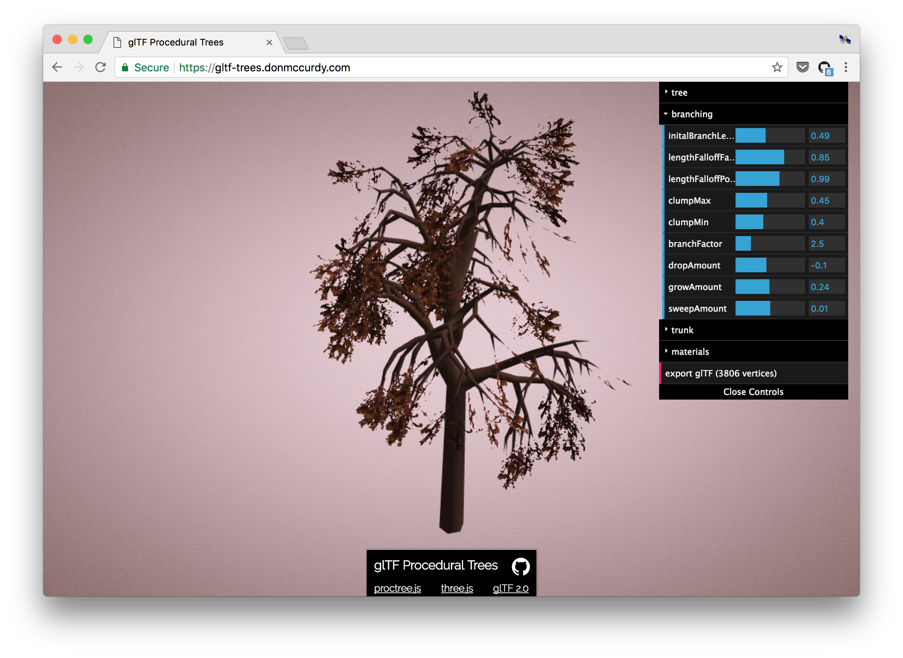

# glTF-Procedural-Trees

Create procedural glTF 2.0 trees with proctree.js and three.js.

Demo: https://gltf-trees.donmccurdy.com/

## Credits

* [proctree.js](https://github.com/supereggbert/proctree.js) — Procedural tree creation library by @supereggbert.
* [three.js](https://threejs.org/) — JavaScript 3D library.
